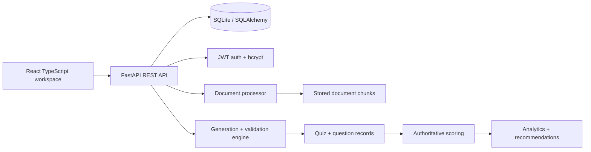

# QuizForge AI — Assessment Suite

QuizForge is a **source-grounded assessment workspace** that turns learning material into validated quizzes and measurable practice. It ships as a full-stack app with a **FastAPI** backend, **SQLite** persistence, PDF/DOCX/TXT extraction, optional LLM-backed generation, deterministic Demo Mode, authoritative server-side scoring, analytics, shareable student quizzes, and JSON/PDF export.

The interface uses a **pistachio-green ("pista")** primary brand with **teal** and **warm amber-gold** accents, with full light and dark themes.

---

## ✨ Features

- **Auth & accounts** — email/password register + login returning a JWT; bcrypt password hashing; protected routes via bearer tokens; session auto-expiry on 401.
- **Quiz workspace** — create, edit, publish, close, and reopen quizzes with a point-weighted question set (MCQ, true/false), difficulty, subject, and optional time limit.
- **Shareable student quizzes** — publishing generates a short `QFxxxxx` share code; students attempt the quiz from a share link with server-side, authoritative scoring.
- **Results & analytics** — per-quiz results with correct / incorrect / unanswered counts, percentages, and score distribution; dashboard overview metrics and topic breakdown.
- **Demo Mode** — curated Operating Systems question set served whenever no LLM provider key is configured; keeps the same API and persistence boundaries.
- **LLM-backed generation (optional)** — Groq provider with structured JSON output, schema validation, source grounding checks, and automatic correction/duplicate retries.
- **Document ingestion** — upload TXT / PDF / DOCX (bounded size) or fetch a URL; text extraction, cleaning, and chunk persistence for future retrieval.
- **Export** — download quizzes as JSON or a printable PDF.
- **Responsive UI** — React + TypeScript + Vite with animated 3-D mascot (React Three Fiber), framer-motion transitions, and pista-branded theming.

---

## 🗂 Project layout

```
.
├─ backend/               # FastAPI application
│  ├─ app/
│  │  ├─ api/routes/      # auth, documents, quizzes, analytics, health
│  │  ├─ core/            # config (pydantic-settings), security (bcrypt/JWT)
│  │  ├─ db/              # SQLAlchemy engine + session
│  │  ├─ models/          # SQLAlchemy ORM entities
│  │  ├─ services/        # document_processor, llm_service, question_engine
│  │  ├─ main.py          # app factory + router wiring
│  │  └─ schemas.py       # Pydantic request/response models
│  ├─ tests/              # pytest API + core unit tests
│  ├─ seed.py             # demo user/quizzes/attempts seeding
│  ├─ Dockerfile
│  ├─ requirements.txt
│  └─ .env.example
├─ frontend/              # React + TypeScript + Vite UI
│  ├─ src/
│  │  ├─ components/      # Dashboard, QuizWorkspace, QuizCreator, StudentQuiz,
│  │  │                   # QuizAnalytics, Charts, LoginCharacter, etc.
│  │  ├─ premium.css      # pista-branded design tokens (light + dark)
│  │  └─ styles.css       # component styling + tokens
│  ├─ index.html
│  ├─ package.json
│  ├─ vite.config.ts
│  └─ Dockerfile
├─ docker-compose.yml
└─ README.md
```

---

## 🏃 Run locally

### Prerequisites
- Python 3.11+
- Node.js 20+
- (Optional) A [Groq](https://groq.com) API key for LLM-backed generation

### 1. Backend

```powershell
python -m venv venv
venv\Scripts\Activate.ps1
cd backend
pip install -r requirements.txt
cp .env.example .env      # then set GROQ_API_KEY if you want LLM mode
uvicorn app.main:app --reload --port 8001
```

### 2. Frontend

```powershell
cd frontend
npm install
npm run dev
```

Open **http://localhost:5173**. Interactive API docs live at **http://localhost:8001/docs**.

### 3. Seed demo data (optional)

```powershell
cd backend
..\venv\Scripts\python.exe seed.py
```

Creates one demo creator account, two demo quizzes (one draft, one published with a share code), and ten demo student attempts.

---

## 🐳 Run with Docker

```powershell
docker compose up -d --build
```

| Service   | URL |
|-----------|-----|
| Frontend  | http://localhost:5173 |
| Backend   | http://localhost:8001 |
| API docs  | http://localhost:8001/docs |

---

## 🧭 Frontend UI (views)

- **Dashboard** — live metrics (quiz/attempt counts, avg score) and focus areas.
- **Quizzes** — workspace listing your quizzes, with *Results* and *Analytics* actions.
- **Create** — build a quiz with point-weighted, multi-type questions; generate from topic via LLM/Demo.
- **Question bank / History / Help & About** — informational views describing the current flow.
- **Sign in / Register** — JWT-backed auth modal with an animated pista mascot.
- **Student quiz** — share-code entry and attempt-taking with server scoring.

---

## 🧠 Architecture



The intended production pipeline: **document extraction → cleaning → chunking → retrieval → structured generation → schema validation → source grounding → duplicate detection → correction → quiz persistence**. Demo Mode currently supplies curated Operating Systems questions while preserving the same API and persistence boundaries.

### Design tokens

All branding is driven by CSS custom properties in `premium.css` / `styles.css`:

| Token | Light | Dark |
|-------|-------|------|
| `--brand` (pista) | `#88b04b` | `#88b04b` |
| `--brand-bright` | `#a9c96b` | `#a9c96b` |
| `--brand-deep` | `#5f8a2b` | `#5f8a2b` |
| `--brand-ink` | `#3d5717` | `#3d5717` |
| Accent (teal) | `#00bfa5` | `#00bfa5` |
| Gold (amber) | `#f5b93f` | `#f5b93f` |
| Background / surface | pale pista (`#eef3eb`) | deep pine (`#0b120d`) |

---

## 🔌 API reference

All endpoints are prefixed with `/api`. See `/docs` for the interactive Swagger UI.

### Health
| Method | Path | Description |
|--------|------|-------------|
| GET | `/health` | Service liveness check |
| GET | `/health/runtime` | Runtime / environment details |

### Auth (`/api/auth`)
| Method | Path | Description |
|--------|------|-------------|
| POST | `/register` | Create account → returns JWT + user |
| POST | `/login` | Sign in → returns JWT + user |
| GET | `/me` | Current authenticated user (bearer) |

### Documents (`/api/documents`)
| Method | Path | Description |
|--------|------|-------------|
| POST | `/upload` | Upload TXT/PDF/DOCX (bounded by `MAX_UPLOAD_SIZE_MB`) |
| POST | `/fetch-url` | Fetch + extract text from a URL |
| GET | `` | List ingested documents |

### Quizzes (`/api/quizzes`)
| Method | Path | Description |
|--------|------|-------------|
| POST | `/generate` | Create a quiz from topic (+ source text) via LLM or Demo Mode |
| POST | `` | Create a quiz manually |
| GET | `` | List your quizzes |
| GET | `/{quiz_id}` | Get a quiz (full detail) |
| PUT | `/{quiz_id}` | Update quiz / questions |
| DELETE | `/{quiz_id}` | Delete a quiz |
| POST | `/{quiz_id}/publish` | Publish → issue a `QFxxxxx` share code |
| POST | `/{quiz_id}/close` | Close a quiz to attempts |
| POST | `/{quiz_id}/reopen` | Reopen a closed quiz |
| GET | `/{quiz_id}/results` | Attempt results for a quiz |
| GET | `/{quiz_id}/analytics` | Analytics for a quiz |
| GET | `/{quiz_id}/export/json` | Export quiz as JSON |
| GET | `/{quiz_id}/export/pdf` | Export quiz as PDF (ReportLab) |

### Sharing (`/api/quizzes/share`)
| Method | Path | Description |
|--------|------|-------------|
| GET | `/share/{share_code}` | Fetch a published quiz by share code |
| POST | `/share/{share_code}/attempts` | Start a student attempt |
| POST | `/share/{share_code}/attempts/{attempt_id}/submit` | Submit + server-score an attempt |
| GET | `/attempts/{attempt_id}/result` | Get an attempt result |

### Analytics (`/api/analytics`)
| Method | Path | Description |
|--------|------|-------------|
| GET | `/overview` | Overall dashboard metrics |
| GET | `/topics` | Breakdown by topic |
| GET | `/history` | Attempt history |

---

## ⚙️ Configuration (`backend/.env`)

Copy `backend/.env.example` → `backend/.env`. No real secrets are committed.

| Key | Default | Purpose |
|-----|---------|---------|
| `GROQ_API_KEY` | *(empty)* | Groq key; when set, LLM-backed generation is enabled |
| `LLM_PROVIDER` | `groq` | Provider name for generation |
| `DATABASE_URL` | `sqlite:///./quizforge.db` | SQLAlchemy connection string |
| `MAX_UPLOAD_SIZE_MB` | `20` | Upload size cap for documents |
| `EMBEDDING_MODEL` | *(empty)* | Reserved for future local embeddings |
| `SIMILARITY_THRESHOLD` | `0.85` | Duplicate-detection threshold |
| `MAX_CORRECTION_ATTEMPTS` | `3` | LLM retries on validation failure |
| `MAX_LLM_CONTEXT_CHARS` | `12000` | Source context cap sent to the LLM |
| `JWT_SECRET` | dev default | **Change in production** |
| `JWT_ALGORITHM` | `HS256` | JWT signing algorithm |
| `JWT_EXPIRE_MINUTES` | `1440` | Token lifetime (24 h) |

Provider calls are isolated from Demo Mode. Large documents are bounded to `MAX_LLM_CONTEXT_CHARS` before generation to stay within Groq token limits.

---

## 🧪 Tests

```powershell
cd backend
..\venv\Scripts\python.exe -m pytest
```

- `tests/test_core.py` — text cleaning, chunking, question validation, duplicate detection.
- `tests/test_api.py` — end-to-end flow: auth → quiz creation → publish → student attempt → scoring → results → analytics → security boundaries (ownership, duplicate submits).

Frontend unit tests (Vitest) run with:

```powershell
cd frontend
npm test
```

---

## 🔐 Security notes

- Passwords are hashed with **bcrypt** (never stored in plaintext).
- Routes are protected with **JWT bearer tokens**; `get_current_user` rejects missing/expired/invalid tokens with a 401.
- Quiz ownership is enforced on all quiz routes — a user can only view/edit/delete their own quizzes (attempts are the exception, via public share codes).
- Demo/attempt scoring is always **server-side and authoritative**; client-provided correctness is ignored.
- Uploads are size-bounded and restricted to TXT/PDF/DOCX.

---

## 🧰 Tech stack

**Backend** — Python 3.11 · FastAPI · SQLAlchemy 2 · SQLite · Pydantic v2 · bcrypt · PyJWT · PyMuPDF · python-docx · ReportLab · httpx · pytest

**Frontend** — React · TypeScript · Vite · React Router 7 · React Three Fiber / drei · three · framer-motion · lucide-react · vitest

---

## 🚀 Future increments

Provider-backed structured generation at scale, local embeddings/vector retrieval, automatic correction retries, richer attempt review, adaptive difficulty rules, a real shared question bank, student history views, and Google Forms integration can be added behind the existing service boundaries without changing the quiz-taking contract.

---

## 📄 License

Released under the [MIT License](LICENSE).

